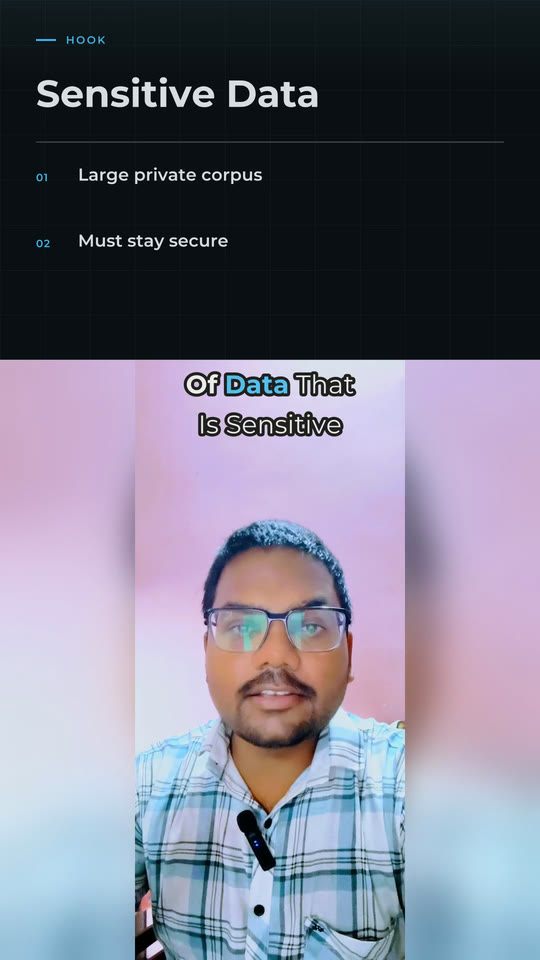
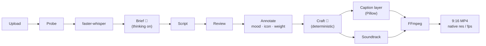
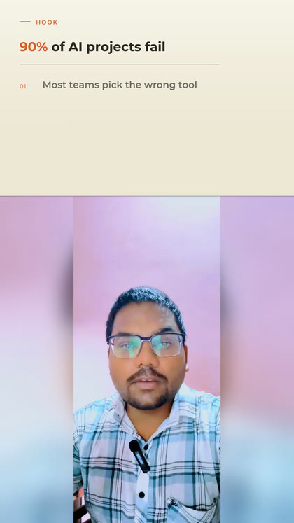
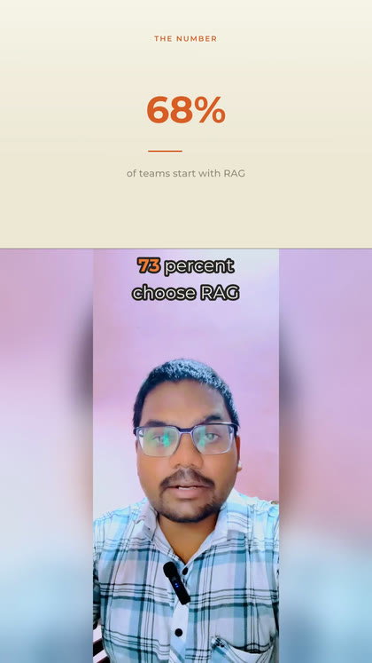
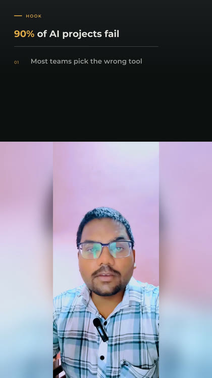
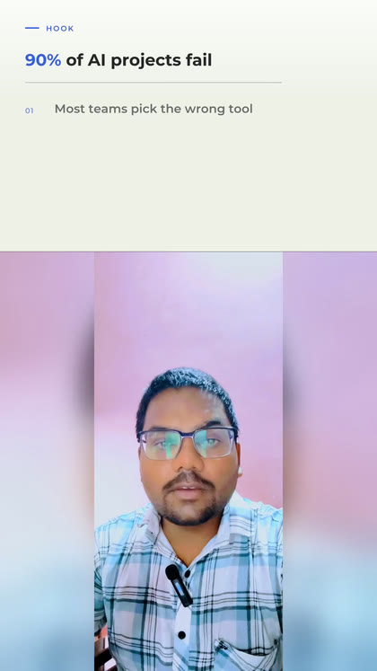
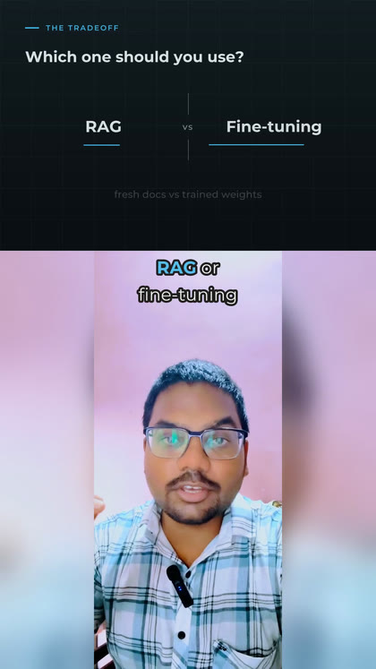
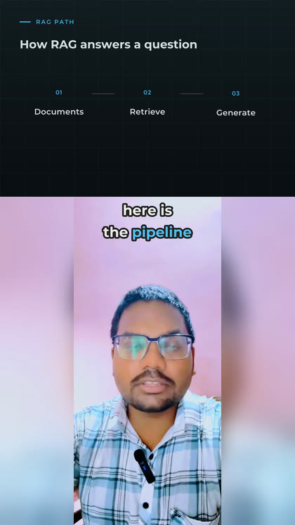

<div align="center">

# Kalki

**An AI editorial engine that turns a talking-head clip into a finished, hook-first vertical reel.**

Whisper transcribes. A DeepSeek agent writes the story, the copy, and the on-screen design.
A Pillow + FFmpeg renderer draws it in native resolution with an adaptive soundtrack.

[](#quick-start)
[](#http-api)
[](#rendering)
[](#how-it-works)
[](#testing)
[](#license)

[Demo](#demo) · [Features](#features) · [Quick start](#quick-start) · [How it works](#how-it-works) · [Caption design](#caption-design) · [HTTP API](#http-api) · [Configuration](#configuration)

</div>

---

## Demo

<p align="center">
  <a href="docs/samples/director-demo.mp4">
    
  </a>
</p>

<p align="center">
  <a href="docs/samples/director-demo.mp4"><strong>▶ Watch the caption director on a real vertical reel</strong></a>
  <br><sub>Native 1188×2112 @ 60 fps source · adaptive text color as the background swings from shade to open sky</sub>
</p>

Older split-screen / audio-reel samples are further down in [Split-screen mode](#split-screen--audio-reel-mode).

## Why

Most auto-caption tools group ASR words and drop a template on top — same white
text, same box, every video. Kalki treats captions as an editorial decision: an LLM
reads the whole talk, decides what the hook is, which words earn a cream accent,
where a genuine surprise beat deserves a snappy pop instead of a smooth rise, and
whether a line about a platform or a dollar figure earns a small icon. A
deterministic layer then enforces the taste rules — rhythm, rarity, minimum
on-screen time — so the output never looks like a slot machine, and stays legible
even when the speaker walks from a dark room into open sky.

## Features

- 🧠 **A real editorial pass, not keyword spotting** — a 4-stage DeepSeek pipeline (brief → script → review → annotate) reads the whole transcript before writing a single caption, in English, Hindi, or Hinglish.
- 🎬 **9 caption treatments** — plain, mix, serif, stack, quote, hand-drawn oval, underline, paper-tape sticker, and a colored stat/highlight chip in 3 rotating colors — assigned by rhythm rules so the same look never repeats too often.
- 🎙️ **Real acoustic emphasis, not just text** — the only signal in the pipeline read from the actual voice: a cheap loudness pass flags the rare moment the speaker's own voice gets genuinely louder than their typical level, earning a pop or a colored highlight even on a line the transcript alone reads flat.
- ✨ **Mood-aware motion** — a line the AI reads as a genuine surprise or high (from the words, or from real vocal loudness) "blinks" in with a quick pop instead of the usual smooth rise.
- 🎨 **Colored highlights beyond just numbers** — the chip background fires on a specific figure (`$2,000`, `40 lakh`) *or* a line judged genuinely surprising/excited *or* a real volume spike — a figure always keeps first claim on the slot.
- 🏷️ **14 contextual icon badges** — money, growth, idea, video, social, check, warning, time, target, fire, heart, star, lock, question — hand-drawn badges on the line that's unmistakably about one of those.
- 🌓 **Per-caption adaptive color** — one low-res pass reads the real background brightness under *each* caption's own on-screen window and flips the whole palette (white/cream ↔ dark-ink/gold) so nothing goes invisible on a bright wall or open sky.
- 🎯 **A front-loaded hook** — the first 30 seconds gets first claim on the rare accents, because that window decides whether someone keeps watching.
- 🔊 **An adaptive soundtrack** — a mood-matched music bed (licensed track or synthesized ambient pad), ducked under the voice with a sidechain compressor, plus a sparse set of risers and sparkles tied to the caption design — never a hit per word.
- 🖼️ **Native-resolution rendering** — keeps the source's own resolution and frame rate (60 fps phone footage stays 60 fps) instead of downscaling to a fixed 1080p/30fps master.
- 🈳 **Hindi / Hinglish in, English out** — Whisper decodes non-English speech straight to timed English words, and the brief pass fixes ASR mishearings (`cloud` → `Claude`, `WHO` staying `WHO`) from context.
- 🧩 **A split-screen mode** for a classic motion-graphics layout (theme cards, SFX) when you don't want the full-frame caption director — see [below](#split-screen--audio-reel-mode).

## How it works



| Stage | What happens |
| --- | --- |
| **Probe** | Duration, resolution, frame rate, rotation. |
| **Transcribe** | `faster-whisper`, word-level timestamps. Non-English speech decodes straight to English (`WHISPER_OUTPUT_LANGUAGE=en`) so timings survive translation. |
| **Brief** *(thinking on)* | Topic, hook, music mood, key ideas, and a glossary of ASR mishearings — the one pass that reasons about the whole talk. |
| **Script** | Every transcript segment becomes short spoken lines (1–4 words). Machine checks reject condensed, invented, or over-long lines and retry with the exact problem. |
| **Review** | One pass over the full caption list for meaning and flow across line breaks. |
| **Annotate** | Per line: the key word, an importance weight, a kind (payoff/concept/term/drama/quote), a **mood** (neutral → surprise/excited/serious/…), and a candidate **icon**. |
| **Craft** *(deterministic)* | Turns judgement into the actual look: word-level timing from real ASR alignment, style rhythm (a serif payoff every ~7s, a hand-drawn accent every ~20s, never the same accent twice), the hook-window boost, and the per-caption background color. |
| **Render** | Type is rasterized with Pillow (baseline-aligned mixed fonts, soft shadows, hand-drawn ovals/underlines/tape/chips/icons) and streamed to FFmpeg as a transparent RGBA band composited above the speaker. |

Everything above is the **full-frame** path — the default. There's also an older
**split-screen** path (motion-graphics cards, 4 fixed themes) described in
[Split-screen mode](#split-screen--audio-reel-mode).

## Caption design

| Treatment | Look | Fires on |
| --- | --- | --- |
| `plain` | White Montserrat | Connective speech |
| `mix` | White sans + **one** cream serif word | The line's meaningful noun/verb |
| `serif` | Whole line in cream Playfair | A payoff or contrast |
| `stack` | Big cream hook + white line under it | The opening beat |
| `quote` | Cream serif in curly quotes | A rule of thumb |
| `oval` | Cream serif circled by a hand-drawn ring + sparkles | The key concept of a beat |
| `underline` | Hairline rule + sparkle | A concrete key term |
| `tape` | Dark serif on a torn sage sticker | One dramatic word |
| `chip` | Colored rounded pill (navy / terracotta / forest, rotating) | A specific figure, a genuine surprise/excited line, or a real vocal-loudness spike |
| `bubble` | Black rounded pill + star sparkle (`caption_style=premium` only) | A direct follow/subscribe/comment ask |

**Mood → motion.** A line the annotate pass reads as `surprise` or `excited` — or one
the speaker's own voice gets genuinely louder on — pops in with a quick scale-bounce
instead of the standard rise — on just the emphasized word inside an ordinary sentence,
or the whole phrase for a one-beat style like `serif`. Roughly one in 8-10 lines, not
once per video.

**Acoustic emphasis.** The only signal here read from the actual audio rather than the
transcript: a cheap RMS-loudness pass over the voice track (the same 16kHz mono file
already extracted for Whisper) flags the rare span where the speaker is genuinely
louder than their own typical level — relative to their own spread, not a fixed dB
number, since mic gain varies per recording. A real spike earns the same pop/chip
treatment as an LLM-judged high point, even on a line the transcript alone reads flat.

**Icon badges — 14 of them.** `money` `growth` `idea` `video` `social` `check`
`warning` `time` `target` `fire` `heart` `star` `lock` `question` — small hand-drawn
circular badges beside the line that's unmistakably about one of those. At most one
every ~13 seconds, and never doubled up with a `chip` line (the pill is already the
"notice this" signal).

**Adaptive color.** Every caption independently reads the real video luminance under
its own time window (one cheap low-res decode of the whole reel, not a single guess)
and picks white/cream or dark-ink/deep-gold accordingly — so a hook shot in open sky
and a mid-roll shot in a dim room both stay fully legible, in the same render.

<p align="center">
  
  &nbsp;
  
  &nbsp;
  
</p>

### Premium caption style

`?caption_style=premium` on `POST /videos` layers three extra, sparingly-used moves
on top of the same AI-judged captions — classic is untouched unless you ask for this:

| Feature | Look | Fires on |
| --- | --- | --- |
| `bubble` | A black rounded pill with a cream outline and a small star sparkle | The rare line the director tags as a direct ask — follow, subscribe, comment |
| Hand-marker font | `plain`/`mix`/`serif` lines rendered in a real chalk/marker typeface (Permanent Marker) instead of the usual sans | Short (1-4 word) lines, spaced at least 15s apart |
| Chest placement | The caption sits over the chest/torso instead of above the head | Framing permitting (skipped on a tight face-filling close-up), spaced at least 9s apart |

The bubble is an LLM decision (the director tags a line `cta`); the font and screen
position are decided deterministically in the renderer, which is the only layer that
actually knows the video's framing geometry. The very first caption (the hook) is
never touched, so the opening beat always looks the same as classic.

```bash
curl -F "file=@talk.mp4" "http://127.0.0.1:8000/api/v1/videos?caption_style=premium"
```

<p align="center">
  <a href="docs/samples/premium-marker-preview-12s.mp4"><strong>▶ Hand-marker font</strong></a>
  &nbsp;·&nbsp;
  <a href="docs/samples/premium-bubble-preview-8s.mp4"><strong>▶ CTA bubble</strong></a>
</p>

## Sound

- **Music** — a licensed track in `MUSIC_DIR` wins (mood words in the filename help
  the picker); otherwise a warm ambient bed is synthesized for the director's mood
  (pads + a soft arpeggio, no drums), ducked under the voice with a sidechain
  compressor to sit ~18 dB below it.
- **Accents** — a soft riser on the hook, a synthesized sparkle on an oval/underline,
  a swoosh under a tape sticker, a rounded "bloop" pop under a premium CTA bubble. At
  most one every 12 seconds.
- **Voice** — high-pass filtered, gently compressed, and the final mix normalized to
  −15 LUFS / −1.5 dBTP for Reels/TikTok/Shorts delivery.

## Rendering

Full-frame reels keep the **source's own resolution and frame rate** — a 60 fps
1188×2112 phone clip renders at 1188×2112 @ 60 fps, not downsampled to a fixed
1080×1920 @ 30 fps master. Sources under `OVERLAY_MIN_WIDTH` (1080px) are upscaled
with Lanczos + a light unsharp pass to keep captions crisp. Every render encodes to a
staging file and moves it into place atomically, so an interrupted render can never
masquerade as the finished output.

## Quick start

**Requires** Python 3.12, system FFmpeg + FFprobe (macOS: `brew install ffmpeg-full`),
and a [DeepSeek](https://platform.deepseek.com) API key.

```bash
git clone <this-repo>
cd "video editor"
python3.12 -m venv .venv312
source .venv312/bin/activate
pip install -r requirements.txt
cp .env.example .env
```

Drop your key in a plain-text file (git-ignored) and point `.env` at it — or set
`LLM_API_KEY` directly:

```bash
echo "sk-..." > deepseek_key.txt
```

```env
# .env
DEEPSEEK_KEY_FILE=deepseek_key.txt
DIRECTOR_MODEL=deepseek-v4-pro
FFMPEG_PATH=/opt/homebrew/opt/ffmpeg-full/bin/ffmpeg
FFPROBE_PATH=/opt/homebrew/opt/ffmpeg-full/bin/ffprobe
```

### Run the API

```bash
uvicorn app.main:app --reload --port 8000
```

```bash
curl -F "file=@talk.mp4" "http://127.0.0.1:8000/api/v1/videos"
```

Poll `GET /api/v1/jobs/{job_id}` until `"status": "completed"`, then:

```bash
curl -o reel.mp4 "http://127.0.0.1:8000/api/v1/jobs/{job_id}/result"
```

A finished job also writes `brief.json` (what the director understood) and
`captions.json` (every line, its treatment, mood, icon, and word-reveal timing) next
to the MP4 — so an edit can be inspected, or hand-tuned, without calling the LLM again.

### Run locally, no server

```bash
python scripts/run_pipeline.py talk.mp4 storage/my_run
```

Pass `classic`/`premium` as the 6th argument (after theme, split, and an optional
reference transcript) to try the [premium caption style](#premium-caption-style):

```bash
python scripts/run_pipeline.py talk.mp4 storage/my_run "" false "" premium
```

Pass a 4th argument pointing at a `.md`/`.txt` transcript to use it as ground truth
for meaning while Whisper still supplies the timing — useful when you already have an
accurate script and just want Whisper's word-level alignment.

## HTTP API

| Method | Path | Purpose |
| --- | --- | --- |
| `POST` | `/api/v1/videos` | Talking-head reel. Full-frame caption director by default. |
| `POST` | `/api/v1/videos?caption_style=premium` | Same director, plus CTA bubble / hand-marker font / chest placement — see [above](#premium-caption-style). |
| `POST` | `/api/v1/videos?split_screen=true` | The older split-canvas layout (see below). |
| `POST` | `/api/v1/reels?theme=` | Audio-only → full-canvas motion reel. |
| `GET` | `/api/v1/jobs/{job_id}` | Status, stage, progress, `job_dir`, `output_path`. |
| `GET` | `/api/v1/jobs/{job_id}/result` | The finished MP4. |
| `GET` | `/api/v1/themes` | `paper` · `noir` · `tech` · `ivory` (split-screen only). |

Job stages: `uploaded → validating → extracting_audio → transcribing →
generating_captions → planning_edits → rendering → completed`.

`POST /videos` also accepts an optional `transcript` file field — an uploaded
transcript is used as ground truth for meaning (names, terms, mishearings) while
Whisper still supplies word-level timing.

## Configuration

The values that change the output. Full list in [`.env.example`](.env.example).

| Variable | Default | Role |
| --- | --- | --- |
| `DEEPSEEK_KEY_FILE` | `deepseek_key.txt` | Plain-text key file; wins over `LLM_API_KEY`. |
| `DIRECTOR_MODEL` | `deepseek-v4-pro` | The caption director's model. |
| `CAPTION_DIRECTOR_ENABLED` | `true` | `false` falls back to the older per-word caption agent. |
| `WHISPER_MODEL` | `tiny` | Use `small`/`medium`/`large-v3` for production accuracy. |
| `WHISPER_OUTPUT_LANGUAGE` | `en` | Decode target — keeps timing on Hindi/Hinglish speech. |
| `OVERLAY_MIN_WIDTH` | `1080` | Captions rasterize at least this wide; smaller sources are upscaled. |
| `OVERLAY_CRF` / `OVERLAY_PRESET` | `17` / `fast` | Full-frame delivery encode — visually transparent, fast. |
| `MUSIC_ENABLED` / `MUSIC_DIR` / `MUSIC_GAIN_DB` | `true` / `assets/music` / `-32` | Soundtrack bed under the voice. |
| `SFX_ENABLED` / `SFX_DIR` | `true` / `Sound Effects V4` | Timed accents. |
| `MAX_VIDEO_DURATION_SEC` | `0` | `0` = no upload cap. |
| `STORAGE_DIR` | `storage` | Uploads, jobs, and rendered output. |

The director runs *thinking* only for the brief pass; script/review/annotate run
without it — thinking adds minutes per call for no quality gain on those.

## Split-screen / audio-reel mode

An older, template-driven path for a classic motion-graphics layout instead of the
full-frame caption director: 4 locked color themes, a graphics planner that picks a
card kind (hook, stat, versus, process, quote) per sentence, and an ADK-agent
pipeline (transcript repair → editorial analysis → captions → graphics → SFX). Used
automatically for audio-only uploads (`POST /reels`), or for video with
`?split_screen=true`.

<p align="center">
  
  
  
  
</p>

<p align="center">
  
  
  
  
</p>

<p align="center">
  <a href="docs/samples/tech-run-preview.mp4"><strong>▶ Split-screen sample</strong></a>
  &nbsp;·&nbsp;
  <a href="docs/samples/audio-reel-preview.mp4"><strong>▶ Audio-reel sample</strong></a>
</p>

```bash
curl -F "file=@talk.mp4" "http://127.0.0.1:8000/api/v1/videos?theme=tech&split_screen=true"
curl -F "file=@talk.wav" "http://127.0.0.1:8000/api/v1/reels?theme=paper"
```

```bash
python scripts/run_reel.py talk.wav storage/reel_run paper
python scripts/preview_graphics.py talk.mp4 storage/preview tech
```

## Project layout

```
app/
  api/routes.py              HTTP surface
  pipeline/runner.py         Job orchestration
  transcription/             faster-whisper
  captions/
    director.py              DeepSeek: brief · script · review · annotate
    craft.py                 Timing, rhythm, mood/icon gating, background color
  renderer/
    caption_layer.py         Pillow caption frames → FFmpeg
    soundtrack.py             Music bed, accents, ducking, loudness
    ffmpeg_renderer.py        Native-res encode, atomic staging
    design.py / canvas.py / split.py / ass.py    Split-screen theming + motion
  editorial/                 Split-screen only: transcript repair, scenes, graphics, sfx, zoom
assets/fonts/                 Montserrat + Playfair Display
docs/samples/                 README preview clips and stills
scripts/                      Local runners (no API server needed)
```

## Testing

```bash
pytest -q
```

102 tests. LLM calls are stubbed with a fake completions client so the director,
craft, and rendering logic run deterministically offline; the renderer tests exercise
the real FFmpeg filter graph and Pillow compositing.

## License

Private project — all rights reserved. Not currently licensed for reuse or
redistribution.

<p align="center">
  <sub>Output: source resolution and frame rate, H.264 + AAC, faststart. Split-screen output is fixed 1080×1920 @ 30fps.</sub>
</p>
