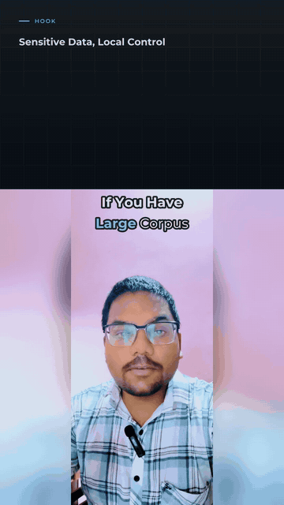
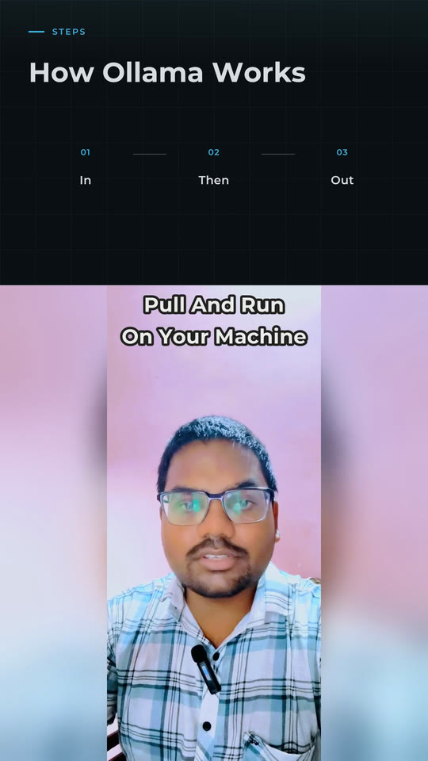
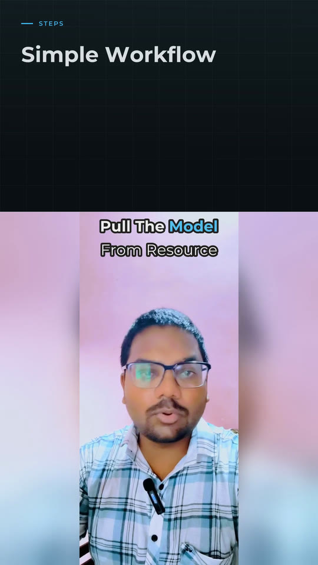
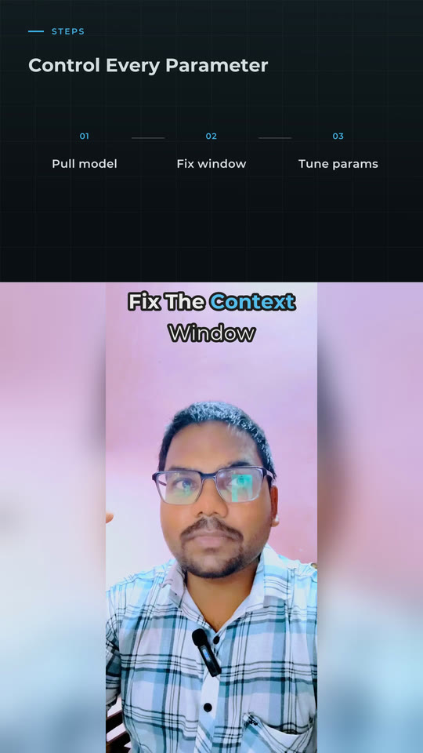
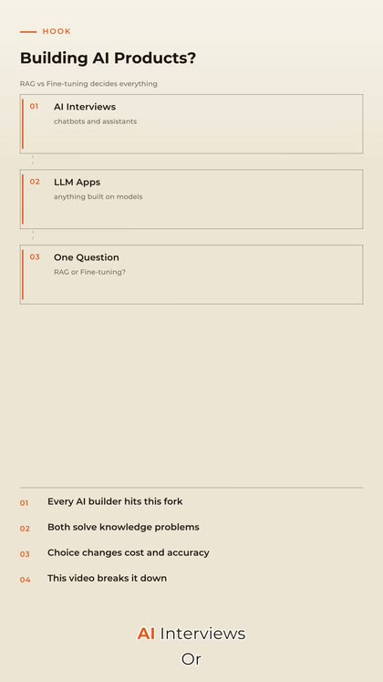
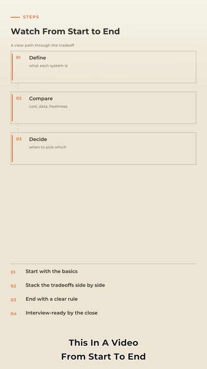
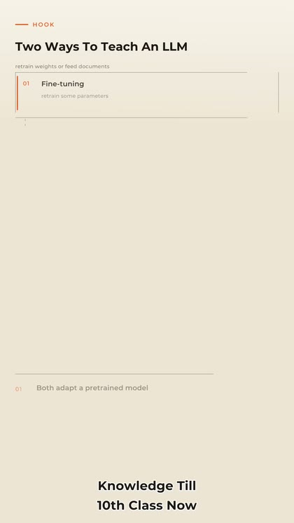
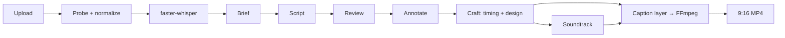

<p align="center">
  
</p>

<h1 align="center">AI Reel Editor</h1>

<p align="center">
  <strong>An editorial engine that turns talking-head video or a voice track into a finished 9:16 reel.</strong><br>
  Whisper transcribes. Agents write captions, design motion cards, and place sound.<br>
  FFmpeg renders a 1080×1920 MP4.
</p>

<p align="center">
  <a href="docs/samples/tech-run-preview.mp4"><strong>Play sample</strong></a>
  &nbsp;·&nbsp;
  <a href="#sample-output">Stills</a>
  &nbsp;·&nbsp;
  <a href="#quick-start">Quick start</a>
  &nbsp;·&nbsp;
  <a href="#http-api">API</a>
</p>

<p align="center">
  
  
  
  
</p>

---

Upload a clip or an audio file. The pipeline transcribes with [faster-whisper](https://github.com/SYSTRAN/faster-whisper), runs a DeepSeek **caption director**, and composites a vertical reel: premium editorial captions, a quiet music bed, and a few timed accents.

Full-frame talking-head reels (the default) use the caption director and a Pillow-rasterized caption layer. Pass `split_screen=true` for the older split canvas with motion-graphics cards and Google ADK agents.

Two products, one engine:

| | Talking-head video | Audio-only reel |
| --- | --- | --- |
| **Input** | MP4 / MOV talking-head | WAV, MP3, M4A, AAC, FLAC, Opus |
| **Layout** | Full-frame 9:16 (default). Split canvas when `split_screen=true` | Full-frame 1080×1920 motion graphics |
| **Endpoint** | `POST /api/v1/videos` | `POST /api/v1/reels` |
| **CLI** | `scripts/run_pipeline.py` | `scripts/run_reel.py` |

## The caption director

Hindi, Hinglish or English speech, in; a designed English caption track, out.

1. **Transcribe** — faster-whisper. Non-English speech is decoded straight to
   English so word timings survive translation (`WHISPER_OUTPUT_LANGUAGE=en`).
2. **Brief** (thinking) — topic, hook, music mood, key ideas, a glossary of
   mishearings (`cloud` → `Claude`), and a corrected transcript.
3. **Script** — every segment becomes short spoken lines of 1–4 words. Machine
   checks reject condensed, invented or over-long lines and retry with the exact
   problem ("segment 4 drops spoken words: alternatives, trade-offs").
4. **Review** — one pass over the whole edit for meaning and flow.
5. **Annotate** — per line: the key word, an importance weight, and a kind
   (payoff, concept, term, drama, quote).
6. **Craft** (deterministic, `app/captions/craft.py`) — turns judgement into the
   look and guarantees the rhythm: lines aligned onto real word timings, a serif
   payoff about every 7 s, hand-drawn accents about every 20 s, never the same
   accent twice, never four plain lines in a row, nothing on screen under 0.7 s.

| Treatment | What it is | When it fires |
| --- | --- | --- |
| `plain` | White Montserrat | Connective speech |
| `mix` | White sans + one cream Playfair word | The meaningful noun or verb |
| `serif` | Whole line in cream serif | A payoff or contrast |
| `stack` | Big cream serif hook + white sans line under it | The opening beat |
| `quote` | Cream serif in curly quotes | A rule of thumb |
| `oval` | Cream serif circled by a drawn oval with sparkles | The key concept of a beat |
| `underline` | Hairline rule with a sparkle | A concrete key term |
| `tape` | Dark serif on a torn sage tape sticker | One dramatic word |

Type is rasterized with Pillow at delivery width (`OVERLAY_MIN_WIDTH`, default
1080), baseline-aligned across mixed fonts, with photographic shadows that get
stronger on bright walls. The layer is streamed to FFmpeg as a transparent RGBA
band and overlaid just above the speaker's head.

## Sound

Premium reels are quiet: a bed under the whole voice and a handful of accents,
never a hit per word.

- **Music** — licensed tracks in `MUSIC_DIR` win (mood words in the filename help
  the picker). Otherwise a warm ambient bed is synthesized for the director's
  mood — pads and a soft arpeggio, no drums — so every reel has a bed with no
  licensing risk. It is ducked under the voice with a sidechain compressor and
  sits ~18 dB below it.
- **Accents** — a soft riser on the hook, a synthesized sparkle when an oval or
  underline lands, a swoosh under tape. At most one per 12 s.
- **Voice** — high-pass, gentle compression, and the whole mix normalized to
  −15 LUFS / −1.5 dBTP.

## Sample output

Real render from `storage/tech_run/output.mp4` — a 191-second talking-head reel in the **tech** theme (dark slate, cyan accent, hairline grid). The clip below is the opening 18 seconds; the stills are later cards from the same file.

<p align="center">
  <a href="docs/samples/tech-run-preview.mp4">
    
  </a>
</p>

<p align="center">
  <a href="docs/samples/tech-run-preview.mp4"><strong>▶ Watch 18s preview</strong></a>
  &nbsp;·&nbsp;
  <code>docs/samples/tech-run-preview.mp4</code>
</p>

<p align="center">
  
  &nbsp;
  
  &nbsp;
  
  &nbsp;
  
</p>

<p align="center">
  <sub>Hook · process · workflow · parameters — generated, not templated.</sub>
</p>

Audio-only path (no camera). The scene director fills the entire 9:16 frame:

<p align="center">
  
  &nbsp;
  
  &nbsp;
  
</p>

<p align="center">
  <a href="docs/samples/audio-reel-preview.mp4"><strong>▶ Audio reel preview</strong></a>
  &nbsp;·&nbsp;
  <code>docs/samples/audio-reel-preview.mp4</code>
</p>

## Themes

Four locked palettes. Neutral carries the frame; accent is reserved for kickers, indices, and stats. Override per job with `?theme=` (same query-string style as `split_screen`) or the CLI third argument.

<p align="center">
  
  &nbsp;
  
  &nbsp;
  
  &nbsp;
  
</p>

| Theme | Surface | Ink | Accent | Character |
| --- | --- | --- | --- | --- |
| **paper** | Warm cream `#F7F2E9` | Near-black | Burnt orange | Editorial, default |
| **noir** | Cinematic black `#0D0E11` | Warm off-white | Amber gold | Documentary |
| **tech** | Dark slate + 5% grid | Cool white | Cyan `#38BDF8` | Product / systems |
| **ivory** | Gallery off-white | Neutral ink | Royal blue | Minimal |

## What the agents design

The graphics planner picks a card kind from the sentence — hook, contrast, number, process, quote — then the renderer draws it as ASS motion on a 1080-wide canvas.

<p align="center">
  
  &nbsp;
  
  &nbsp;
  
  &nbsp;
  
</p>

| Kind | When it fires |
| --- | --- |
| `bullets` / `term_card` | Hook or key insight with supporting lines |
| `vs_split` | Contrast, tradeoff, “A vs B” |
| `stat` | A number the viewer should remember |
| `process` / `diagram` | A sequence of steps |
| `quote` / `topic` | A take, a line worth holding |

These cards are the split-screen and audio-reel look. SFX hits (`whoosh`, `swoosh`, `impact`, `hit`) land on card changes from `Sound Effects V4`. Full-frame talking-head reels do not use cards: they use the caption director above.

## Pipeline



Split-screen jobs keep the older route: transcript repair → editorial analysis →
caption agent → graphics + SFX → FFmpeg.

1. **Probe** — duration, codec, sample rate. Reject or cap by `MAX_VIDEO_DURATION_SEC`.
2. **Transcribe** — faster-whisper with VAD. Word-level timestamps.
3. **Repair** — ADK agent corrects Whisper slips (`RAKA` → `RAG`) without rewriting the talk.
4. **Editorial** — roles, hooks, numbers, contrast, story position.
5. **Captions** — grouped on-screen lines with emphasis spans.
6. **Scenes** — full-frame cards for audio reels; split-layout cards when `split_screen=true`.
7. **SFX** — timed hits under the voice.
8. **Render** — FFmpeg: gradients, grid, ASS overlays, zoom, mix, H.264.

Talking-head jobs skip transcript repair and the scene director. Split jobs use split graphics and skip punch-in zooms; the default full-frame path uses zoom + overlay graphics instead.

## Quick start

**Requires** Python 3.12, system FFmpeg with `drawtext` and `gradients` (macOS: `brew install ffmpeg-full`), and `ffprobe`.

```bash
python3.12 -m venv .venv312
source .venv312/bin/activate
pip install -r requirements.txt
cp .env.example .env
```

Set at least `LLM_API_KEY` in `.env`. Point FFmpeg at a build that actually has libass / drawtext:

```env
LLM_MODEL=openai/deepseek-v4-flash
LLM_API_KEY=
LLM_BASE_URL=https://api.deepseek.com
FFMPEG_PATH=/opt/homebrew/opt/ffmpeg-full/bin/ffmpeg
FFPROBE_PATH=/opt/homebrew/opt/ffmpeg-full/bin/ffprobe
```

### API server

```bash
uvicorn app.main:app --reload --port 8000
```

Talking-head (full-frame by default — captions and zooms on the speaker):

```bash
curl -F "file=@talk.mp4" "http://127.0.0.1:8000/api/v1/videos?theme=tech"
```

Talking-head with split screen (graphics above, face below):

```bash
curl -F "file=@talk.mp4" "http://127.0.0.1:8000/api/v1/videos?theme=tech&split_screen=true"
```

Audio reel:

```bash
curl -F "file=@talk.wav" "http://127.0.0.1:8000/api/v1/reels?theme=paper"
```

A full-frame job writes `brief.json` (what the director understood) and
`captions.json` (every line, its treatment, and its word reveal times) next to the
MP4, so an edit can be inspected or hand-tuned without re-running the LLM.

Poll `GET /api/v1/jobs/{job_id}` until `status` is `completed`, then download `GET /api/v1/jobs/{job_id}/result`.

`POST /videos` and `POST /reels` return a `job_id` UUID immediately. That same UUID is the folder under `storage/jobs/`. The finished MP4 is stored there as `output.mp4`:

```text
storage/jobs/<job_id>/
  source.mp4      uploaded file
  job.json        status
  output.mp4      rendered reel (when completed)
```

### Local, no server

```bash
python scripts/run_pipeline.py talk.mp4 storage/real_run tech
python scripts/run_reel.py     talk.wav storage/reel_run paper
python scripts/preview_graphics.py talk.mp4 storage/preview tech
```

`preview_graphics.py` renders a 26-second visual QA reel — one card per kind — and dumps frames. Useful when iterating on a theme.

## HTTP API

Query params on the upload endpoints (`theme`, `split_screen`) are the per-job overrides. Omit a param to keep the default.

| Method | Path | Purpose |
| --- | --- | --- |
| `GET` | `/api/v1/themes` | `paper` · `noir` · `tech` · `ivory` |
| `POST` | `/api/v1/videos?theme=&split_screen=` | Talking-head reel. Split only when `split_screen=true` |
| `POST` | `/api/v1/reels?theme=` | Audio → full-canvas reel |
| `GET` | `/api/v1/jobs/{job_id}` | Status, stage, progress, `job_dir`, `output_path` |
| `GET` | `/api/v1/jobs/{job_id}/result` | Final MP4 from `storage/jobs/{job_id}/output.mp4` |

| Query param | Endpoints | Default | Values |
| --- | --- | --- | --- |
| `theme` | `/videos`, `/reels` | `GRAPHICS_THEME` (`paper`) | `paper` · `noir` · `tech` · `ivory` |
| `split_screen` | `/videos` | `false` | `true` / `false` — split layout only when `true` |

Job stages: `uploaded` → `validating` → `extracting_audio` → `transcribing` → `generating_captions` → `planning_edits` → `rendering` → `completed`. Split-screen and audio jobs also pass through `repairing_transcript` and `analyzing_editorial`.

## Configuration

Copy `.env.example`. The values that change the picture:

| Variable | Default | Role |
| --- | --- | --- |
| `LLM_MODEL` / `LLM_API_KEY` / `LLM_BASE_URL` | DeepSeek via LiteLLM | All editorial agents |
| `WHISPER_MODEL` | `tiny` | Use `small` / `medium` for production accuracy |
| `GRAPHICS_THEME` | `paper` | Default palette; per-job override wins |
| `OUTPUT_WIDTH` / `OUTPUT_HEIGHT` / `OUTPUT_FPS` | `1080` / `1920` / `30` | Delivery spec |
| `MAX_VIDEO_DURATION_SEC` | `0` | `0` = no upload cap |
| `CAPTION_CHUNK_SECONDS` | `0` | `0` = one caption request for the whole talk |
| `SPLIT_LAYOUT_ENABLED` | `true` | CLI / renderer fallback. The videos API ignores this and only splits when `?split_screen=true` |
| `SFX_ENABLED` / `SFX_DIR` | `true` / `Sound Effects V4` | Mix under voice |
| `TRANSCRIPT_REPAIR_LLM_ENABLED` | `true` | Whisper typo pass |
| `SCENES_LLM_ENABLED` | `true` | Audio-reel scene director |
| `CAPTION_FONT_PATH` | `assets/fonts/Montserrat-*.ttf` | On-canvas type |
| `DEEPSEEK_KEY_FILE` | `deepseek_key.txt` | Plain-text key file; wins over `LLM_API_KEY` |
| `DIRECTOR_MODEL` | `deepseek-v4-pro` | Caption director |
| `CAPTION_DIRECTOR_ENABLED` | `true` | Full-frame reels; `false` falls back to the old agent |
| `WHISPER_OUTPUT_LANGUAGE` | `en` | Decode target. Keeps timings on Hindi / Hinglish speech |
| `OVERLAY_MIN_WIDTH` | `1080` | Captions rasterize at least this wide |
| `MUSIC_ENABLED` / `MUSIC_DIR` / `MUSIC_GAIN_DB` | `true` / `assets/music` / `-32` | Bed under the voice |
| `STORAGE_DIR` | `storage` | Uploads, jobs, artifacts |

The director runs thinking only for the brief; the per-line passes run without it
(thinking costs minutes per chunk for no gain on those). Do not set `reasoning_effort`.

## Layout

```
app/
  api/routes.py              HTTP surface
  pipeline/runner.py         Job orchestration
  transcription/             faster-whisper
  editorial/
    transcript/              Repair agent
    scenes/                  Full-canvas reel director
    graphics/                Split-layout cards + glyphs
    sfx/                     Hit planner + library
    zoom/                    Punch-in scoring
  captions/                  Grouped on-screen lines
  renderer/
    caption_layer.py         Pillow caption frames piped to FFmpeg
    soundtrack.py            Music bed, accents, ducking, loudness
    design.py                Themes and tokens
    canvas.py                Full-frame scenes
    split.py                 Talking-head split
    ass.py                   Motion overlay
    ffmpeg_renderer.py       Encode
assets/fonts/                Montserrat
docs/samples/                README preview clips and stills
scripts/                     Local runners
```

## Tests

```bash
pytest -q
```

Editorial LLM calls are stubbed in `tests/conftest.py`. Renderer and graphics tests exercise the real FFmpeg filter graph.

---

<p align="center">
  <sub>Output is always 1080×1920, 30 fps, H.264 + AAC. Themes live in <code>app/renderer/design.py</code>.</sub>
</p>
